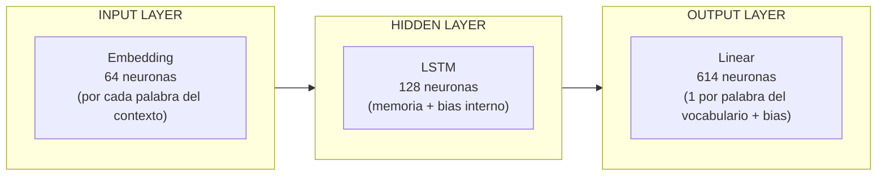

# `src/modelo_lstm.py` — Paso 3: Arquitectura de la red neuronal (LSTM)

## ¿Qué hace?

Define el modelo `GeneradorDeLetras`, la red neuronal que va a aprender el patrón de las letras. Tiene 3 piezas encadenadas:

1. **Embedding** — convierte cada número-de-palabra en un vector de 64 números que la red va *aprendiendo* durante el entrenamiento. Palabras usadas en contextos parecidos ("amor", "cariño") terminan con vectores parecidos.
2. **LSTM** — recorre la secuencia de esos vectores palabra por palabra, manteniendo una "memoria" de lo que ya leyó, para relacionar la palabra actual con las anteriores.
3. **Capa de salida (Linear)** — toma esa memoria final y la convierte en un puntaje por cada palabra del vocabulario ("qué tan probable es que sea la siguiente"). La de mayor puntaje es la predicción.

## Flujo de datos

```
[números de palabras] --Embedding--> [vectores] --LSTM--> [memoria] --Linear--> [puntajes por palabra]
```

## Importante

Este archivo **solo define la forma** del modelo — todavía no aprende nada, los pesos están sin entrenar. Eso pasa en el siguiente paso (`entrenamiento.py`).

## Cómo probarlo

```bash
python src/modelo_lstm.py
```

Corre una prueba rápida con datos inventados solo para confirmar que las dimensiones cuadran (entrada de secuencias de palabras → salida de puntajes por palabra del vocabulario).

## ¿Dónde están el input layer, hidden layer y output layer?



- **Input layer (64 neuronas):** capa `Embedding`. Convierte cada palabra (número) en un vector de 64 valores. Con una secuencia de 4 palabras, entran 4 vectores de 64 en total.
- **Hidden layer (128 neuronas):** capa `LSTM`. Aquí vive la "memoria" de la red y los pesos + bias que se van ajustando durante el entrenamiento.
- **Output layer (614 neuronas):** capa `Linear`. Una neurona de salida por cada palabra posible del vocabulario, más su bias — la neurona con el puntaje más alto es la palabra predicha.
